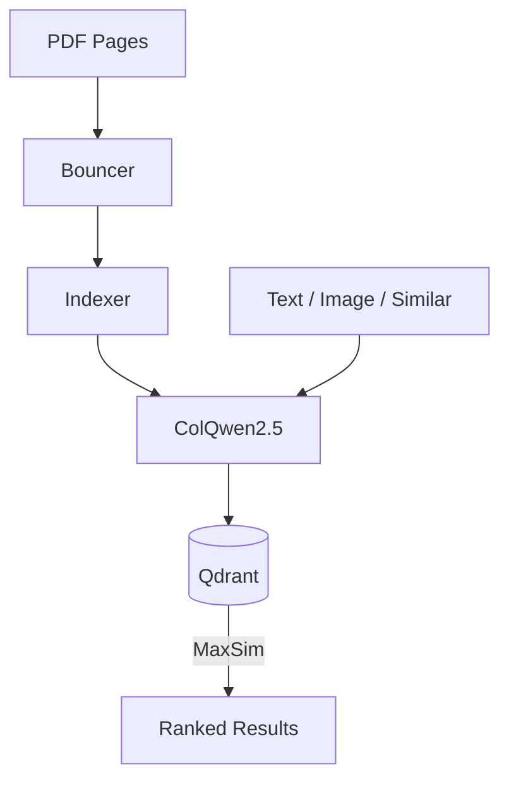

# PDfiles


do you have lots of pdfs that you want to search through visually? do you have an nvidia gpu?  if yes, this is for you!

### Features

#### search through pdfs by text description (not OCR)
  

https://github.com/user-attachments/assets/880c4caf-1367-4836-bc36-ef35524e1b2d


#### search for all photos similar to a particular photo
  

https://github.com/user-attachments/assets/5ab6b907-5b08-4ef9-8ead-4b1b25510ce0


#### reverse image search — upload a photo to find similar pages


#### can use OPT files to speed up indexing


#### can export your index files to backup or share with others
 - on the web gui with admin mode enabled, or via cli

## Quick Start

1. Install [Docker](https://docs.docker.com/get-docker/)
2. Clone the repo:
   ```bash
   git clone https://github.com/pdfiles/pdfiles.git
   cd pdfiles
   ```
3. Configure:
   ```
   cp .env.example .env
   # Edit .env — set DATA_PATH to your documents folder
   ```
4. Start:
   ```bash
   ./pdfiles.sh up
   ```
   On Windows: `pdfiles.bat up`

5. Open http://localhost

To stop: `./pdfiles.sh down` (or `pdfiles.bat down` on Windows)

First startup downloads the search model (~4 GB) and takes 2-3 minutes.

## Usage

| Command | Description |
|---------|-------------|
| `./pdfiles.sh up` | Start services |
| `./pdfiles.sh update` | Pull latest images and restart |
| `./pdfiles.sh down` | Stop services |
| `./pdfiles.sh logs` | View logs |
| `./pdfiles.sh status` | Health check |
| `./pdfiles.sh backup` | Backup index to sqlite |
| `./pdfiles.sh restore DIR` | Restore from a backup |
| `./pdfiles.sh --help` | All commands |

### A note on updates

Qdrant data is stored in a docker volume that will persist `down` and `up`, reboots, etc. 
Updates should not affect this, which you can do with `pdfiles update`, but if you have spent a long time indexing files, it is always safest to `pdfiles backup` first.

**You do not need to reindex files to update**


## Requirements

- Docker and Docker Compose
- NVIDIA GPU (12+ GB VRAM) for indexing, or a prebuilt search index for CPU-only mode:
  ```bash
  docker compose -f docker-compose.cpu.yml up -d
  ```


## How it works

pdfiles scans through all of the pdfs that you mount in `DATA_PATH` and saves each page's essence in the form of vectors.  when you type something in search, these words get turned into vectors; and then the two sets of vectors get compared.  the resulting files are an ordered list of images that are closest to what you search.  this is what enables "find similar photos" as well.


## Architecture


